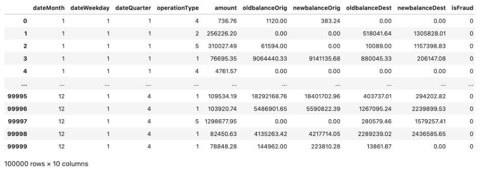
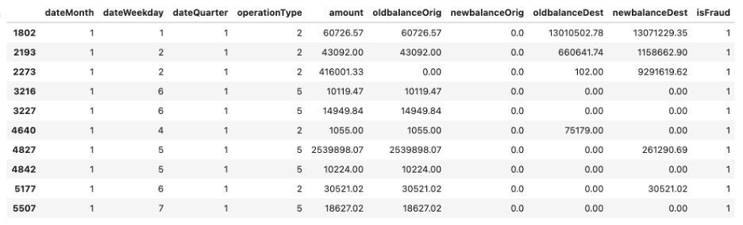
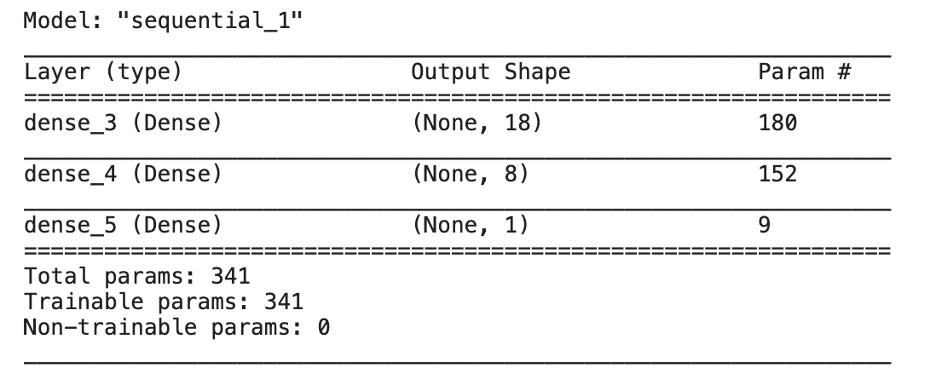
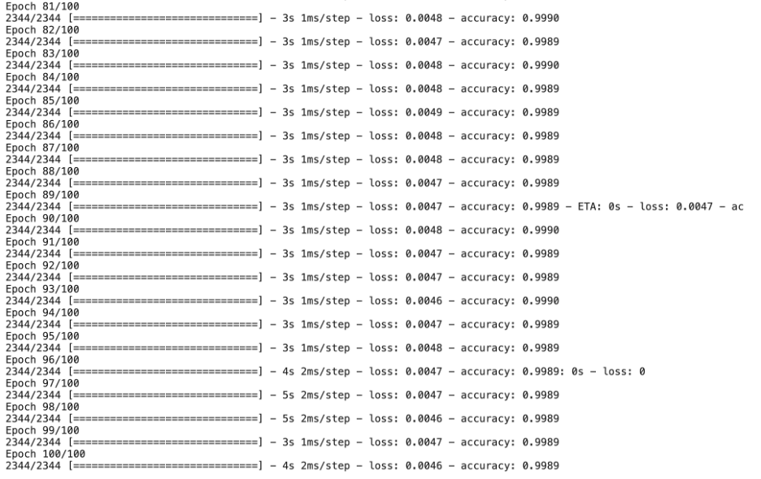
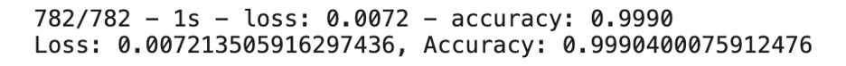

# Predicting Fraudulent Transactions Using Neural Networks

Here you will find a preliminary classification deep learning model to predict fraudulent credit card transactions over 100,000 transactions. We define and evaluate a deep learning model. 

This classification model is preliminar, because the amount of fraudulent transactions is very low in the data, so tecniques for as random oversampling must need to be applied for a final model. Anyway, it is useful as an example of how to apply `TensorFlow` and `Keras` to construct deep learning models. 

## Steps:

### I. Load and Preprocess Data

Out of the 100,000 transactions, only 116 where fraudulent. We have provided those transactions in a CSV file in the "Resources" folder. With these transactions, we create the target set (y), and define the features (X).

The features are related to the Month of the transaction, its quarter, if it is on a weekday or weekend, the type of operation, the amount; and the old and new balances on the original card, and the destination card or account.   

 
 Here is a sample of fraudulent transactions:
 
 
 
 
 We used the `train_test_split` function from scikit-learn to create the training and testing sets.
 Finally, we scale the features data using the `StandardScaler` from `scikit-learn.`

### II. Create and Evaluate a Deep Neural Network Model

We defined the structure of the model as follows:

* 9 inputs

* First hidden layer with 18 neurons

* Second hidden layer with 8 neurons

* Output layer with a single output

* Hidden layers use the ReLU activation function, and output layer uses the sigmoid activation function

We can see the structure summary of the model in the following image:

We compiled the neural network model using the `binary_crossentropy` loss function, the `adam` optimizer, and `accuracy` as an additional metric. 

We fit the model with the training data, using 100 epochs. An screenshot of the end of the training is below.

Finally we evaluate the model using testing data and the `evaluate` method, and found a high accuracy of 99%, as you can see below.
However, giving the low amount of fraudulent transactions, this evaluation is not so relevant. We need to look into other metrics in order to give a better assesment of the performance of this model.

-----

# Technologies

For the neural network model we use `TensorFlow` and `Keras`. `Keras` is an API that allows and easy and friendly design of neural networks. From `Keras`, we use the `Sequential` model to generate a linear stack of layers, `Dense` for the internal definition of the layers itself, and the `evaluate` method for the evaluation of the model.

For the preprocessing of the data we used `StandardScaler`from the `preprocessing` module of `Sklearn`. This means that the data used to train the model was standarized to mean equal zero and standard deviation equal one before using it.

For the separation of the train data and test data groups we used `train_test_split` function from the `model_selection` module of `Sklearn`. We used 75% of the data to train the model, and 25% to test it after.

## References:

[Keras Sequential model](https://keras.io/api/models/sequential/)

[Keras Dense module](https://keras.io/api/layers/core_layers/dense/)

[Keras evaluate](https://keras.io/api/models/model_training_apis/)
